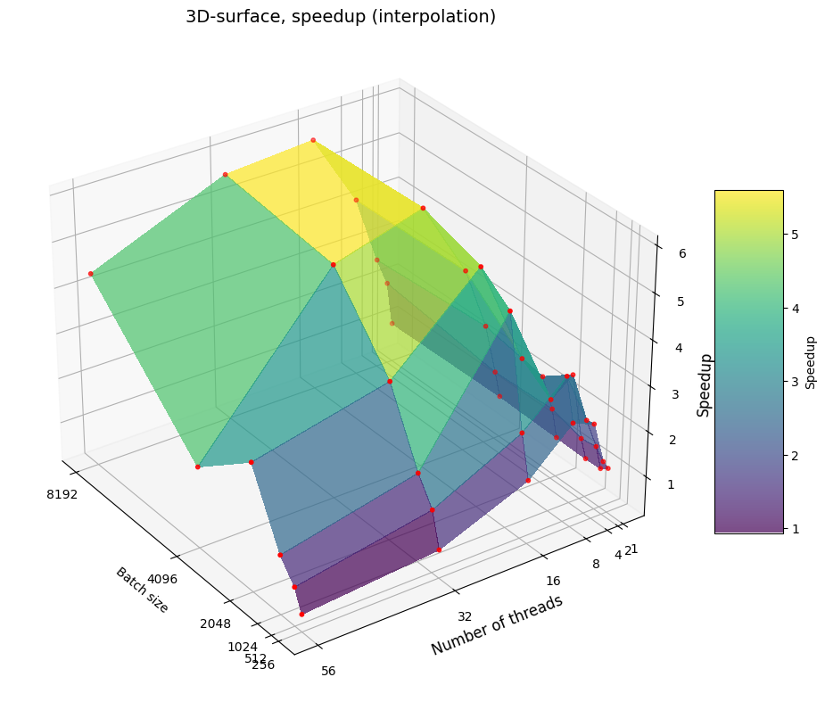

# Parallel Stochastic Gradient Descent in C++

C++ implementation of mini-batch stochastic gradient descent with OpenMP parallelization.  
The project includes a sequential baseline, a parallel version, loss tracking, speedup measurements, and a short mathematical report.

## Overview

The goal of this project is to study the parallelization of stochastic gradient descent for a synthetic regression problem. The implementation compares sequential mini-batch SGD with an OpenMP-based parallel version, where gradient computation inside each mini-batch is distributed across multiple threads.

The dataset is generated synthetically for a regression task:

```text
y = Xw + 5 * sin(x_0) + noise
```

The optimized objective is mean squared error.

### Features
- Sequential mini-batch SGD baseline
- Parallel mini-batch SGD with OpenMP
- Synthetic data generation for regression
- MSE loss computation
- Loss history export to CSV
- Experiments with different batch sizes and thread counts
- Speedup extraction from experiment logs
- 3D speedup surface visualization

### Repository structure
```text
.
├── collect_speedup.sh
├── run_exps.sh
├── sgd.cpp
├── plot_speedup.py
├── docs/
|   ├── parallel_sgd_algorithm.pdf
|   ├── parallel_sgd_experiments.pdf
|   └── submission_report.pdf
└── results/
    ├── losses.zip
    ├── results.zip
    └── parallel_sgd_num_threads_batch_size_speedup_plot.png
```

### Build
The implementation requires a C++ compiler with OpenMP support.
```bash
g++ -O2 -fopenmp sgd.cpp -o sgd_omp_test
```

### Run a Single Experiment
```bash
export OMP_NUM_THREADS=8
./sgd_omp_test 1024
```
The command runs both sequential and parallel SGD with batch size 1024.

### Run All Experiments
```bash
bash run_exps.sh
```
The script evaluates the implementation using:

- batch sizes: ```256```, ```512```, ```1024```, ```2048```, ```4096```, ```8192```
- thread counts: ```1```, ```2```, ```4```, ```8```, ```16```, ```32```, ```56```
Experiment logs are saved to ```results/```.

### Collect Speedup Data
```bash
bash collect_speedup.sh
```
This command creates ```speedup_data.csv``` with columns ```BatchSize```, ```NumThreads```, ```Speedup```, ```SeqTime```, ```ParTime```.

### Plot Speedup Surface
```bash
python plot_speedup.py
```
The script builds a 3D surface showing how speedup depends on batch size and the number of OpenMP threads.

## Experimental Results
The experiments were conducted on the Lomonosov-2 supercomputer at Lomonosov Moscow State University.

<p align="center">
  
</p>

<p align="center">
  <em>Speedup of the OpenMP implementation depending on batch size and the number of threads.</em>
</p>

The best observed speedup was approximately ```5.82x``` for batch size ```4096``` with ```16``` threads.

In general, the parallel version performs better for larger batch sizes, where the cost of gradient computation is high enough to compensate for OpenMP overhead. For small batch sizes or too many threads, synchronization and thread management overhead can reduce speedup.

## Documentation

Additional project materials are available in `docs/`:

- [`parallel_sgd_algorithm.pdf`](docs/parallel_sgd_algorithm.pdf) - mathematical description of the algorithm
- [`parallel_sgd_experiments.pdf`](docs/parallel_sgd_experiments.pdf) - implementation details and experimental results
- [`submission_report.pdf`](docs/submission_report.pdf) - course submission report with motivation and algorithm selection

## AlgoWiki Pages

This project was originally documented as part of AlgoWiki:

- [Mathematical description of stochastic gradient descent algorithm](https://algowiki-project.org/ru/Участница:OvsyannikovaSA/Стохастический_градиентный_спуск)
- [Program implementation and experimental results](https://algowiki-project.org/ru/Участница:OvsyannikovaSA/Программная_реализация_стохастического_градиентного_спуска)

## Implementation Stack
- C++
- OpenMP
- Bash
- Python
- pandas
- matplotlib
- scipy
